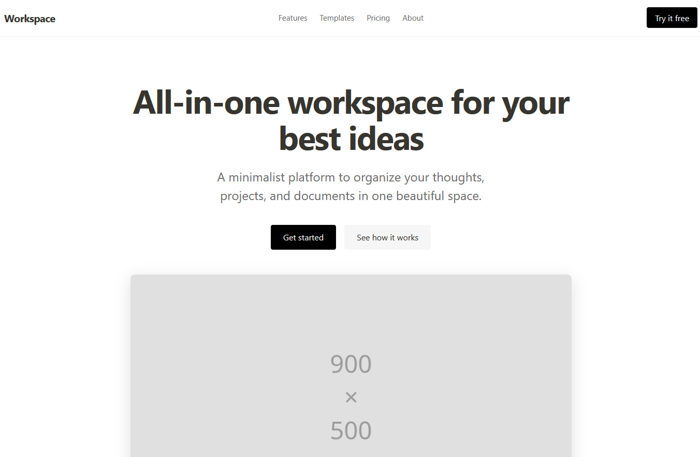
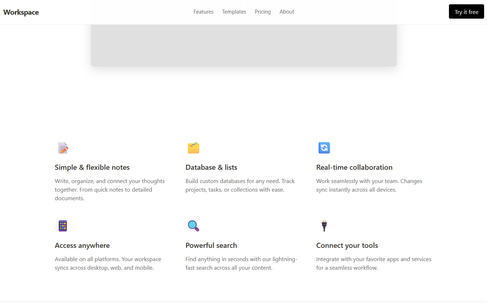
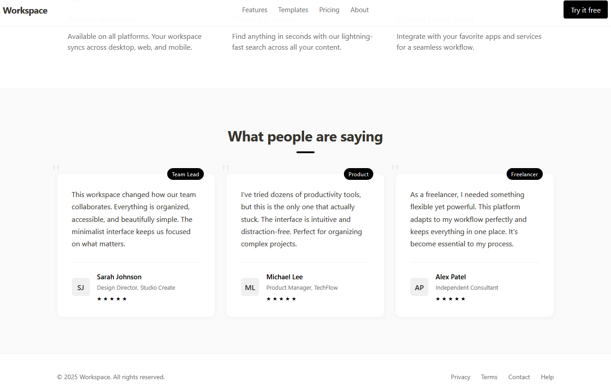

# Notion-Landing-Page

Notion-style landing page with a clean, minimalistic look and with shadcn UI inspired Testimonials section.

This is a Next.JS Application using Typescript and NextJS 14 standards and using APP Router.

File Structure:
/app
  /components
    /ui
      Button.tsx
      Avatar.tsx
    /layout
      Navbar.tsx
      Footer.tsx
    /sections
      Hero.tsx
      Features.tsx
      Testimonials.tsx
  /styles
    globals.css
  layout.tsx
  page.tsx
  favicon.ico
/public
  /placeholder
tsconfig.json
package.json

